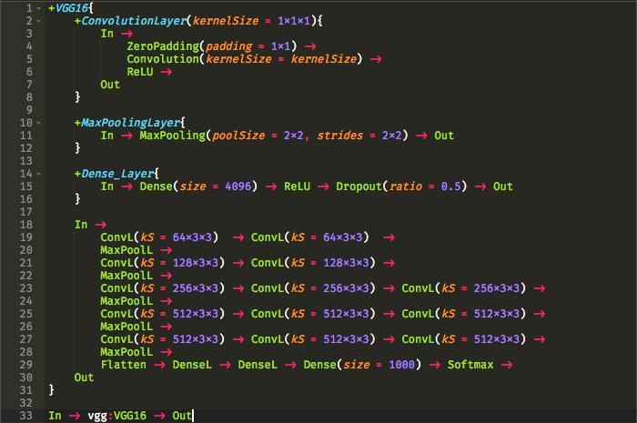

# Moniel: *Notation for Deep Learning Models*
Moniel is human-friendly notation for declarative data flow graphs which can be compiled for TensorFlow runtime.

VGG16:



More [examples](examples).

----------

## Quick Introduction
Moniel is an attempt at creating a notation for deep learning models leveraging graph thinking. Instead of defining computation as list of formulea, we define the model as a declarative dataflow graph. It is *not a programming language*, just a convenient notation that can be executed.

Let's start with nothing, i.e. **comments**:
```
// This is line comment.

/*
	This is block
	comment.
*/
```
Node can be created by stating its **type**:
```
Sigmoid
```
You don't have to write full name of a type. Use **acronym** that fits you! These are all equivalent:
```
LocalResponseNormalization // canonical, but too long
LocRespNorm // weird, but why not?
LRN // cryptic for beginners, enough for others
```
Nodes connect with other nodes with an **arrow**:
```
Sigmoid -> MaxPooling
```
There can be **chain** of any length:
```
LRN -> Sigm -> BatchNorm -> ReLU -> Tanh -> MP -> Conv -> BN -> ELU
```
Also, there can be **multiple chains**:
```
ReLU -> BN
LRN -> Conv -> MP
Sigm -> Tanh
```
Nodes can have **identifiers**:
```
conv:Convolution
```
Identifiers let's you refer to nodes that are used more than once:
```
// inefficient declaration of matrix-matrix multiplication
matrix1:Tensor
matrix2:Tensor
mm:MatrixMultiplication

matrix1 -> mm
matrix2 -> mm
```
However, this can be rewritten without identifiers using **list**:
```
[Tensor,Tensor] -> MatMul
```
Lists let's you easily declare **multi-connection**:
```
// Maximum of 3 random numbers
[Random,Random,Random] -> Maximum
```
**List-to-list connections** are sometimes really handy:
```
// Range of 3 random numbers
[Rand,Rand,Rand] -> [Max,Min] -> Sub -> Abs
```
Some nodes can take **named attributes** that modify their behavior:
```
Fill(shape = 10x10x10, value = 1.0)
```
Attribute names can also be shortened:
```
Ones(s=10x10x10)
```
**Multi-valued attributes** are useful for hyper-parameter tuning:
```
Dropout(ratio = <0.3, 0.5, 0.7>)
```
Defining large graphs without proper structuring is unmanageable. **Scopes** can help:
```
/layer{ // slash denotes scope
	RandomNormal(shape=784x1000) -> weights:Variable
	weights -> dp:DotProduct -> act:ReLU
}

Tensor -> layer/dp // feed input into the DotProduct of the "layer" scope
layer/act -> Softmax // feed output of the "layer" scope into another node
```
Scopes are more powerful when they define proper **Input-Output boundary**:
```
/layer1{
    RandomNormal(shape=784x1000) -> weigths:Variable
    [in:Input,weigths] -> DotProduct -> ReLU -> out:Output
}

/layer2{
    RandomNormal(shape=1000x10) -> weigths:Variable
    [in:Input,weigths] -> DotProduct -> ReLU -> out:Output
}

layer1 -> layer2 // connect scopes directly
```
If scopes have identical structure, we can create a **reusable block** and use it as a normal node:
```
+ReusableLayer(shape = 1x1){
	RandN(shape = shape) -> w:Var
	[in:In,w] -> DP -> RLU -> out:Out
}

RL(s = 784x1000) -> RL(s = 1000x10)
```
Of course, [editor](https://www.youtube.com/watch?v=zVZqHHNQ50c) with proper syntax highlighting and interactive feedback really helps:


----------

## Similar projects and Inspiration
- [TensorGraph](https://github.com/hycis/TensorGraph) – "TensorGraph is a framework for building any imaginable models based on TensorFlow"
- [nngraph](https://github.com/torch/nngraph) – "graphical computation for nn library in Torch"
- [DNNGraph](https://github.com/ajtulloch/dnngraph) – "a deep neural network model generation DSL in Haskell"
- [NNVM](https://github.com/dmlc/nnvm) – "Intermediate Computational Graph Representation for Deep Learning Systems"
- [DeepRosetta](https://github.com/edgarriba/DeepRosetta) – "An universal deep learning models conversor"
- [TensorBuilder](https://cgarciae.github.io/tensorbuilder/) – "a functional fluent immutable API based on the Builder Pattern"
- [Keras](https://keras.io/) – "minimalist, highly modular neural networks library"
- [KeraFlow](https://github.com/ipod825/keraflow) – simplified Keras(?)
- [PrettyTensor](https://github.com/google/prettytensor) – "a high level builder API"
- [TF-Slim](https://github.com/tensorflow/models/blob/master/inception/inception/slim/README.md) – "a lightweight library for defining, training and evaluating models"
- [TFLearn](http://tflearn.org/) – "modular and transparent deep learning library"
- [Caffe](https://github.com/BVLC/caffe) – "deep learning framework made with expression, speed, and modularity in mind"
