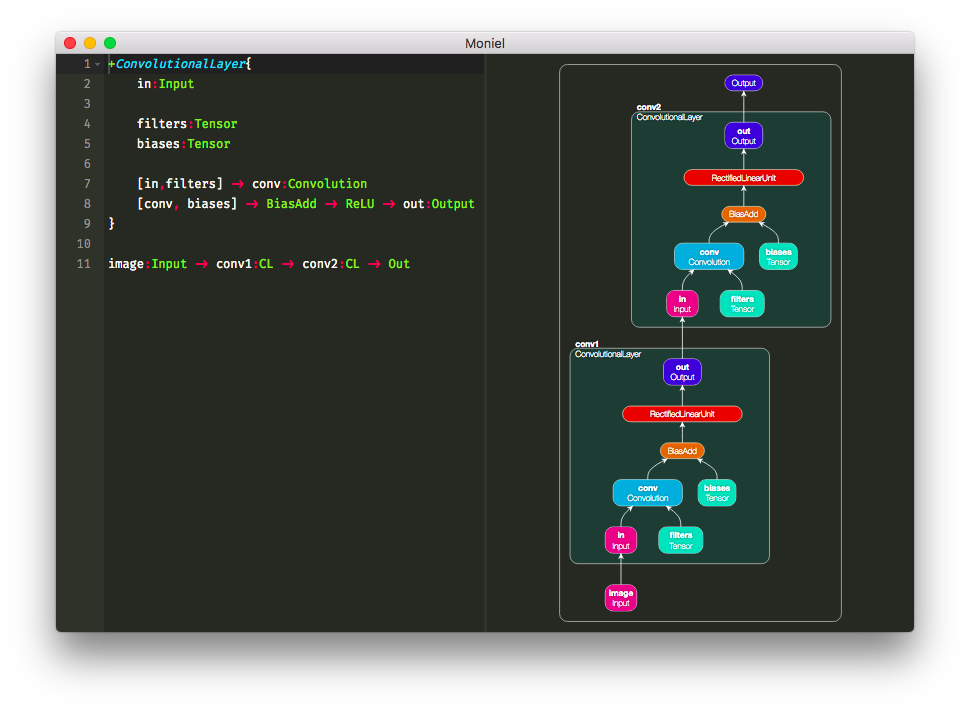

# ⚠️ Notice

[L1: Tensor Studio](https://github.com/mlajtos/L1) - a more practical continuation of the ideas presented in Moniel.

---

# Moniel: *Notation for Computational Graphs*
Human-friendly declarative dataflow notation for computational graphs. See [video](https://www.youtube.com/watch?v=0DC0RMnuwxU).



----------

## Pre-built packages

### macOS

[Moniel.dmg](https://github.com/mlajtos/moniel/raw/master/release-builds/Moniel.dmg) (77MB)

----------

## Setup for other platforms
```
$ git clone https://github.com/mlajtos/moniel.git
$ cd moniel
$ npm install
$ npm start
```

## Quick Introduction
Moniel is one of many attempts at creating a notation for deep learning models leveraging graph thinking. Instead of defining computation as list of formulea, we define the model as a declarative dataflow graph. It is *not a programming language*, just a convenient notation. (Which will be executable. [Wanna help?](https://github.com/mlajtos/moniel/issues))

*Note: Proper syntax highlighting is not available here on GitHub. Use the application for the best experience.*

Let's start with nothing, i.e. **comments**:
```java
// This is line comment.

/*
	This is block
	comment.
*/
```
Node can be created by stating its **type**:
```java
Sigmoid
```
You don't have to write full name of a type. Use **acronym** that fits you! These are all equivalent:
```java
LocalResponseNormalization // canonical, but too long
LocRespNorm // weird, but why not?
LRN // cryptic for beginners, enough for others
```
Nodes connect with other nodes with an **arrow**:
```java
Sigmoid -> MaxPooling
```
There can be **chain** of any length:
```java
LRN -> Sigm -> BatchNorm -> ReLU -> Tanh -> MP -> Conv -> BN -> ELU
```
Also, there can be **multiple chains**:
```java
ReLU -> BN
LRN -> Conv -> MP
Sigm -> Tanh
```
Nodes can have **identifiers**:
```java
conv:Convolution
```
Identifiers let's you refer to nodes that are used more than once:
```java
// inefficient declaration of matrix-matrix multiplication
matrix1:Tensor
matrix2:Tensor
mm:MatrixMultiplication

matrix1 -> mm
matrix2 -> mm
```
However, this can be rewritten without identifiers using **list**:
```java
[Tensor,Tensor] -> MatMul
```
Lists let's you easily declare **multi-connection**:
```java
// Maximum of 3 random numbers
[Random,Random,Random] -> Maximum
```
**List-to-list connections** are sometimes really handy:
```java
// Range of 3 random numbers
[Rand,Rand,Rand] -> [Max,Min] -> Sub -> Abs
```
Nodes can take **named attributes** that modify their behavior:
```java
Fill(shape = 10x10x10, value = 1.0)
```
Attribute names can also be shortened:
```java
Ones(s=10x10x10)
```
Defining large graphs without proper structuring is unmanageable. **Metanodes** can help:
```java
layer:{
    RandomNormal(shape=784x1000) -> weights:Variable
    weights -> dp:DotProduct -> act:ReLU
}

Tensor -> layer/dp // feed input into the DotProduct of the "layer" metanode
layer/act -> Softmax // feed output of the "layer" metanode into another node
```
Metanodes are more powerful when they define proper **Input-Output boundary**:
```java
layer1:{
    RandomNormal(shape=784x1000) -> weigths:Variable
    [in:Input,weigths] -> DotProduct -> ReLU -> out:Output
}

layer2:{
    RandomNormal(shape=1000x10) -> weigths:Variable
    [in:Input,weigths] -> DotProduct -> ReLU -> out:Output
}

// connect metanodes directly
layer1 -> layer2
```
Alternatively, you can use **inline metanodes**:
```java
In -> layer:{[In,Tensor] -> Conv -> Out} -> Out
```
Or you don't need to give it a name:
```java
In -> {[In,Tensor] -> Conv -> Out} -> Out
```
If metanodes have identical structure, we can create a **reusable metanode** and use it as a normal node:
```java
+ReusableLayer(shape = 1x1){
    RandN(shape = shape) -> w:Var
    [in:In,w] -> DP -> RLU -> out:Out
}

RL(s = 784x1000) -> RL(s = 1000x10)
```

----------

## Similar projects and Inspiration
- [Lobe](https://lobe.ai/) ([video](https://www.youtube.com/watch?v=IN69suHxS8w)) – "Build, train, and ship custom deep learning models using a simple visual interface."
- [Serrano](https://github.com/pcpLiu/Serrano) – "A graph computation framework with Accelerate and Metal support."
- [Subgraphs](https://subgraphs.com/) – "Subgraphs is a visual IDE for developing computational graphs."
- 💀[Machine](https://www.youtube.com/watch?v=N9q9qacAKoM) – "Machine is a machine learning IDE."
- [PyTorch](http://pytorch.org) – "Tensors and Dynamic neural networks in Python with strong GPU acceleration."
- [Sonnet](https://github.com/deepmind/sonnet) – "Sonnet is a library built on top of TensorFlow for building complex neural networks."
- [TensorGraph](https://github.com/hycis/TensorGraph) – "TensorGraph is a framework for building any imaginable models based on TensorFlow"
- [nngraph](https://github.com/torch/nngraph) – "graphical computation for nn library in Torch"
- [DNNGraph](https://github.com/ajtulloch/dnngraph) – "a deep neural network model generation DSL in Haskell"
- [NNVM](https://github.com/dmlc/nnvm) – "Intermediate Computational Graph Representation for Deep Learning Systems"
- [DeepRosetta](https://github.com/edgarriba/DeepRosetta) – "An universal deep learning models conversor"
- [TensorBuilder](https://cgarciae.github.io/tensorbuilder/) – "a functional fluent immutable API based on the Builder Pattern"
- [Keras](https://keras.io/) – "minimalist, highly modular neural networks library"
- [PrettyTensor](https://github.com/google/prettytensor) – "a high level builder API"
- [TF-Slim](https://github.com/tensorflow/models/blob/master/inception/inception/slim/README.md) – "a lightweight library for defining, training and evaluating models"
- [TFLearn](http://tflearn.org/) – "modular and transparent deep learning library"
- [Caffe](https://github.com/BVLC/caffe) – "deep learning framework made with expression, speed, and modularity in mind"
